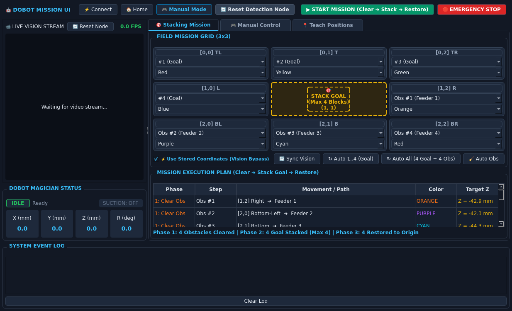
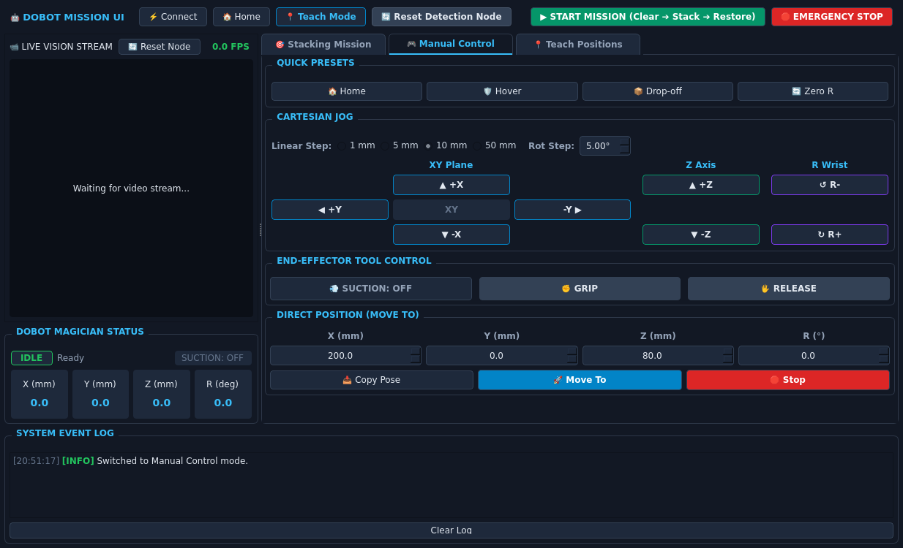
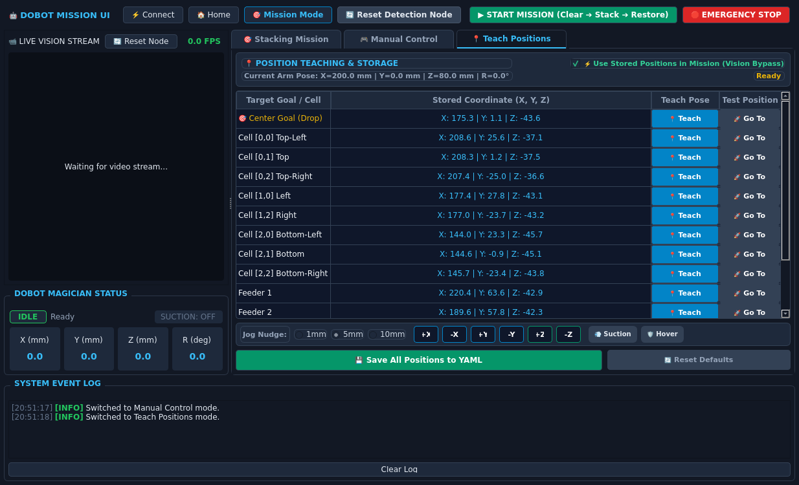

# Dobot Magician Autonomous Stacking Workspace (`dobot_ws`)

A complete ROS 2 robotics workspace for the **Dobot Magician** robotic arm featuring real-time perspective computer vision, automated 8-cube stacking, manual Cartesian jogging controls, and an interactive PyQt mission dashboard.

> 📚 **Complete Beginner-to-Advanced Tutorials (PDF / Markdown)**:
> - 🇹🇭 **คู่มือฉบับสมบูรณ์ภาษาไทย**: [**`DOBOT_TUTORIAL_TH.pdf`**](DOBOT_TUTORIAL_TH.pdf) | [Markdown](docs/DOBOT_MAGACIAN_TUTORIAL_TH.md)
> - 🇬🇧 **Full English Guide**: [**`DOBOT_TUTORIAL_EN.pdf`**](DOBOT_TUTORIAL_EN.pdf) | [Markdown](docs/DOBOT_MAGACIAN_TUTORIAL_EN.md)
> - 📖 **Dual-Language Documentation**: [**`DOCUMENTATION.md`**](DOCUMENTATION.md)

---

## User Interface (PyQt Dashboard)

The graphical user interface (`Dobot_UI`) provides a dark-themed control center divided into three intuitive tabs:

### 1. 🎯 Stacking Mission Tab
Plan, configure, and execute autonomous 3-phase pick-and-place missions with real-time video and telemetry.



- **Live Camera Stream**: Displays real-time perspective-corrected vision feed from `dobot_v2` with FPS counter.
- **Robot Telemetry**: Live Cartesian coordinates ($X, Y, Z, R$) and suction cup indicator (`ON`/`OFF`).
- **Interactive 3x3 Grid**: Assign target blocks (`#1` to `#4` for Center Goal) and obstacle blocks (`Obs #1` to `Obs #4` for Feeders).
- **Automated Routing**:
  - `🔄 Sync Vision`: Automatically syncs detected cube colors from the camera to the grid.
  - `↻ Auto 1..4 (Goal)`: Assigns 4 blocks sequentially to the Goal tower.
  - `↻ Auto All (4 Goal + 4 Obs)`: Sets 4 Goal blocks and routes 4 Obstacle blocks to Feeders 1..4.
  - `🧹 Auto Obs`: Clears non-goal blocks to available feeder slots.
  - `⚡ Use Stored Coordinates`: Toggles pre-calibrated physical positions (vision bypass).
- **3-Phase Execution Table**:
  1. **Phase 1 (Clear)**: Transits obstacles from grid cells to Feeder 1..4.
  2. **Phase 2 (Stack)**: Picks goal blocks and stacks them at Center Goal `[1, 1]` up to 4 levels high.
  3. **Phase 3 (Restore)**: Returns obstacles from feeders back to origin cells.
  4. **Goal Collision Avoidance**: Automatically routes arm trajectories around the perimeter corridors with elevated transit ($Z > 140\,\text{mm}$) to protect the goal stack.

---

### 2. 🎮 Manual Control Tab
Direct robot arm manipulation, fine Cartesian jogging, and tool actuation.



- **Quick Presets**: Instant one-click positioning to `Home`, `Hover` ($Z=80\,\text{mm}$), `Drop-off` ($Z=30\,\text{mm}$), and `Zero R` ($R=0^\circ$).
- **Cartesian Jogging**: Directional D-pad with selectable step sizes ($1\,\text{mm}$, $5\,\text{mm}$, $10\,\text{mm}$, $50\,\text{mm}$) for $X, Y, Z$ axes and $R$ rotation.
- **Tool Control**: One-click toggles for vacuum suction pump and pneumatic/servo gripper.
- **Direct Position (Move To)**: Manual coordinate entry ($X, Y, Z, R$) with live `📥 Copy Pose` and safe PTP execution.

---

### 3. 📍 Teach Positions Tab
Hardware calibration and physical position teaching (ideal when camera vision is occluded or lighting changes).



- **Position Teaching**: Jog the arm to any cell, goal, or feeder, and click **`📍 Teach`** to record real physical coordinates.
- **Position Verification**: Click **`🚀 Go To`** to test navigation to stored coordinates.
- **Permanent Storage**: Click **`💾 Save All Positions to YAML`** to persist taught coordinates into `dobot_ui.yaml`.

---

## Workspace Architecture

```
dobot_ws/
├── DOBOT_TUTORIAL_TH.pdf         # 🇹🇭 Complete 10-page tutorial document (Thai)
├── DOBOT_TUTORIAL_EN.pdf         # 🇬🇧 Complete 10-page tutorial document (English)
├── DOCUMENTATION.md              # 📖 Dual-language technical manual
├── docs/
│   ├── images/
│   │   ├── ui_mission_tab.png    # Mission Tab interface screenshot
│   │   ├── ui_manual_tab.png     # Manual Control Tab screenshot
│   │   └── ui_teach_tab.png      # Teach Positions Tab screenshot
│   ├── DOBOT_MAGACIAN_TUTORIAL_TH.md
│   └── DOBOT_MAGACIAN_TUTORIAL_EN.md
├── src/
│   ├── dobot_v2/                 # Vision tracking, perspective homography & robot arm controller
│   │   ├── config/
│   │   │   ├── dobot_controller.yaml  # Robot kinematics, limits, geometry, effector dwell
│   │   │   ├── detection_node.yaml    # Vision geometry, homography corners, HSV color bounds
│   │   │   └── usb_cam.yaml           # Camera parameters
│   │   ├── dobot_v2/
│   │   │   ├── dobot_controller_node.py # Hardware controller node interfacing UI & arm
│   │   │   ├── dobot_driver.py          # Thread-safe pydobot driver & simulation fallback
│   │   │   ├── mission_executor.py      # 3-Phase trajectory generator with collision avoidance
│   │   │   ├── detection_node.py        # Vision tracker & cube coordinate publisher
│   │   │   ├── transforms.py            # Perspective homography & metric conversions
│   │   │   ├── grid_detector.py         # Pallet contouring & corner locking
│   │   │   ├── cube_detector.py         # Multi-color cube segmenter
│   │   │   ├── visualizer.py            # HUD drawing & visual overlay rendering
│   │   │   └── calibrate_grid.py        # Interactive 4-corner calibration GUI
│   │   └── launch/
│   │       ├── dobot_system.launch.py   # Unified launcher (Cam + Vision + Controller + UI)
│   │       └── dobot_vision.launch.py   # Dedicated vision launcher
│   │
│   ├── Dobot_UI/                 # Modern dark-themed PyQt mission dashboard & manual control
│   │   ├── config/
│   │   │   └── dobot_ui.yaml            # UI geometry, topic mappings, stored positions
│   │   ├── Dobot_UI/
│   │   │   ├── app.py                   # UI entry point & event loop
│   │   │   ├── main_window.py           # Splitter window with 3 tabs (Mission, Manual, Teach)
│   │   │   ├── ros_bridge.py            # ROS 2 communication bridge & interactive mock mode
│   │   │   └── widgets/
│   │   │       ├── control_bar_widget.py    # Top toolbar & mission actions
│   │   │       ├── video_widget.py          # Live annotated video stream viewer
│   │   │       ├── grid_widget.py           # Interactive 3x3 mission grid cards
│   │   │       ├── sequence_widget.py       # 3-phase execution table
│   │   │       ├── manual_control_widget.py # Cartesian jog D-pad, presets, move-to
│   │   │       ├── teach_widget.py          # Teach positions & YAML saver
│   │   │       ├── robot_telemetry_widget.py # Live Cartesian X/Y/Z/R readout
│   │   │       └── log_widget.py            # System event log console
│   │   └── launch/
│   │       └── dobot_ui.launch.py
│   │
│   └── dobot_project/            # Baseline prototype implementation & reference utilities
└── README.md
```

---

## Quick Start (Single-Command Run)

### 1. Launch Everything Together
To launch the camera driver, vision detector, Dobot controller, and UI dashboard with a single command:
```bash
ros2 launch dobot_v2 dobot_system.launch.py
```

### 2. Standalone Simulation / Mock Mode (No Hardware Required)
You can test the entire UI interface, live simulated vision feed, manual jogging, and telemetry without physical hardware:
```bash
python3 src/Dobot_UI/Dobot_UI/app.py --mock
```

---

## System Workflow & Capabilities

### 1. 3-Phase Autonomous Stacking Mission
1. Place colored cubes on the outer cells of the 3x3 pallet grid.
2. The overhead camera detects each cube's centroid and computes its metric coordinates in the Dobot base frame.
3. In [`Dobot_UI`](file:///home/thxncdzch/dobot_ws/src/Dobot_UI), click **Sync Vision** or use **Auto All (4 Goal + 4 Obs)**.
4. Select up to 4 blocks for the **Center Goal** (`#1` to `#4`) and designate remaining blocks as **Obstacles** (`Obs #1` to `Obs #4` routing to Feeders 1..4).
5. Click **▶ START MISSION (Clear ➔ Stack ➔ Restore)**:
   - **Phase 1 (Clear)**: Dobot picks obstacle cubes and temporarily parks them in Feeder slots 1..4.
   - **Phase 2 (Stack)**: Dobot sequentially picks the 4 target cubes and stacks them vertically on Goal `[1, 1]` with exact height offsets.
   - **Phase 3 (Restore)**: Dobot moves obstacle cubes from Feeder slots back to their original grid cells.
   - **Collision Avoidance**: All transit trajectories automatically navigate around perimeter corridors with safe $Z$-clearance ($>140\,\text{mm}$) so the arm never strikes the growing goal tower!

### 2. Full Manual Jogging & Tool Control
1. Select the **🎮 Manual Control** tab or click **🎮 Manual Mode** in the toolbar.
2. Monitor live camera stream and real-time Cartesian telemetry ($X, Y, Z, R$).
3. Select step size ($1\,\text{mm}$, $5\,\text{mm}$, $10\,\text{mm}$, $50\,\text{mm}$) and jog along axes using the D-pad.
4. Test tool actuation with instant suction cup toggle or gripper controls.
5. Use **📥 Copy Pose** to grab current coordinates, adjust values, and click **🚀 Move To**.

### 3. Hardware Teaching & Vision Bypass
1. Select the **📍 Teach Positions** tab to manually record physical coordinates for Goal `[1, 1]`, outer grid cells, and feeder slots.
2. If lighting or camera occlusion disrupts vision processing, check **⚡ Use Stored Coordinates** to execute missions using pre-calibrated physical positions.

---

## Prerequisites & Installation

### ROS 2 & System Packages
```bash
sudo apt update
sudo apt install -y ros-humble-desktop ros-humble-usb-cam ros-humble-cv-bridge python3-pip
```

### Python Dependencies
```bash
pip install pydobot2 PyQt5 opencv-python pyyaml numpy
```

### Serial Port Permissions
To allow non-root communication with the Dobot USB serial device:
```bash
sudo usermod -a -G dialout $USER
```
*(Log out and log back in for group permissions to take effect)*

---

## Package References & Documentation

- [**`dobot_v2` Documentation**](file:///home/thxncdzch/dobot_ws/src/dobot_v2/README.md): Vision tracking, homography math, controller node, and configuration guide.
- [**`Dobot_UI` Documentation**](file:///home/thxncdzch/dobot_ws/src/Dobot_UI/README.md): Mission dashboard, manual control panel, telemetry, and topics.
- [**`dobot_project` Documentation**](file:///home/thxncdzch/dobot_ws/src/dobot_project/README.md): Prototype package and reference scripts.
